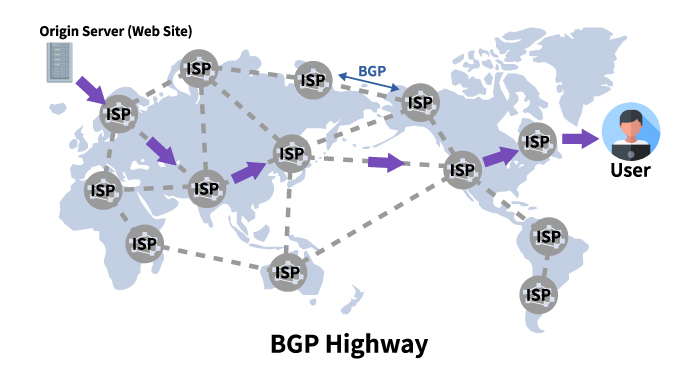

# 1장: 네트워크의 기본

### 개요

이번 장에서는 네트워크란 무엇을 위해 존재하고, 어떻게 구성되어 있는지를 살펴보겠습니다. 네트워크를 학습하다보면 대부분 HTTP, TCP/IP와 같은 세부적인 프로토콜을 배우기 마련입니다. 그 전에 ‘인터넷'이 무엇인지, 앞서 말한 프로토콜들이 왜 필요한 지를 살펴봅니다.

---

### 네트워크는 왜 필요할까요?

- 네트워크는 우리가 사용하는 인터넷, 즉 전자기파로 통신하는 네트워크만을 말하지 않습니다. 사람간의 관계인 인적 네트워크, 택배 시스템이 구축된 물류 네트워크, 신호등간의 관계로 이루어진 교통 네트워크 등 많은 네트워크들이 있습니다.
    - 어떤 요소들이 서로 연결 관계를 맺고 상호간의 커뮤니케이션을 한다면 네트워크인 것이죠.
    - 이 책에서는 이 중 PC, 스마트폰와 같은 정보 단말 기기가 서로 연결 관계를 맺고 커뮤니케이션하여 만들어진 **컴퓨터 네트워크**에 대해서 알아봅니다.
- 네트워크가 필요한 이유는 나에게는 없는 무언가를 얻기 위함입니다. 내가 모든 것을 알고 있다면 네트워크가 필요 없겠죠. 하지만 세상엔 내가 모르는 것, 얻어야할 것들이 넘쳐납니다.
    - 우린 정보를 수집하고 공유해야 합니다.
        - 웹 사이트
        - 문서, 영상 파일
    - 빠르게 멀리 있는 사람과 효율적으로 커뮤니케이션을 해야할 필요도 있죠.

---

### 누가 네트워크를 이용할까?

- 네트워크는 특정 집단이 이용할 수도 있고 세계 모두가 이용할 수도 있습니다. 네트워크를 사용하는 사람이 누군가이냐에 따라 네트워크는 달라집니다.
    - 특정 집단만 제한하여 사용하는 네트워크를 우린 사설 네트워크라고 부릅니다.
        - 주로 회사 내에서나 한 가정에서만 이용하는 네트워크를 말합니다.
    - 반면 누구나 이용할 수 있는 네트워크에는 인터넷이 있습니다. 전 세계 모든 사람이 이용합니다. 인터넷은 Internet(work)라는 사실을 기억하세요.

---

### LAN, WAN

- 앞서 네트워크는 특정 집단만 이용할 수도 있고 전 세계가 이용할 수도 있다고 말했습니다.
    - 특정 회사에서 이용하는 네트워크는 아마 조금은 전 세계보다는 조금 작을겁니다. 다만 서울 지점에서도 인천에서도 이용할 수 있겠죠.
    - 이 때 서울과 인천에서만 사용하는 네트워크를 Local Area Network, LAN이라고 부릅니다. 서로 다른 LAN를 갖고 있는데, 둘이 같은 회사이니 분명히 통신이 필요할 겁니다. 그렇다면 둘을 이어줄 필요가 있겠죠. 이 때 둘을 연결해주는 네트워크가 바로 Wide Area Network, WAN입니다.
        - LAN은 크기가 상대적으로 작기 때문에 개인이 수행할 수 있지만, WAN은 그 크기가 방대해서 통신 사업자가 구축해야 합니다.

---

### ISP가 제공하는 AS(Autonomous System)

- LAN, WAN은 통신사업자가 제공하는 네트워크였습니다. 인터넷은 이런 네트워크들을 모아서 전 세계를 연결합니다. 전 세계의 다양한 조직들이 관리하는 네트워크가 연결된 것이죠.
- 이 때 다양한 조직에서 제공하는 거대한 네트워크들을 Autonomous System(AS)라고 부릅니다. 그리고 이런 AS를 제공하는 조직을 Internet Service Provider(ISP)라고 부릅니다.
    - 이런 ISP들은 서로 Boarder Gateway Protocl(BGP)로 연결되어 있습니다.
    - 인터넷이 전 세계에 네트워크를 연결하려면 결국은 거대한 네트워크끼리 다시 연결이 되어 있어야 합니다. 이 때 가장 높은 레벨에서 연결을 유지하는 상위 네트워크를 제공하는 ISP들을 **Tier1**라고 합니다.
    - Tier1은 Tier1끼리 연결되며 Tier1 하위에 다시 Tier2,3로 계층화됩니다. Tier1은 우리나라에는 없으며 일본의 NTT 커뮤니케이션즈가 있습니다. 대륙간의 네트워크 연결을 위해선 Tier 1이 필요하고, 대륙 내에서 점점 세분화되어 위에서 말한 Tier2,3으로 나누어집니다.
        
        

        
        [http://www.ehostidc.com/common/inc/bgp.php](http://www.ehostidc.com/common/inc/bgp.php)
        
    - 우리가 일반적으로 사용하는 이동통신사 KT는 Tier2 ISP입니다. 국내에서 네트워크를 하기 위해선 Tier1 ISP까진 필요가 없죠. 만약 필요하더라도 우린 KT에게 통신사 요금을 지불했기 때문에 대륙간 통신을 위해 필요한 Tier1 ISP와의 관계는 우리가 지불한 금액으로 KT가 알아서 처리합니다.

---

### 네트워크 아키텍쳐란?

- 우리가 건널목을 건너려고 할 땐 빨간불에 멈추고 초록불에 건넙니다. 이렇 듯 네트워크에 연결된 요소들끼리 통신하려면 특정한 규칙이 필요합니다. 컴퓨터 네트워크에서도 이런 규칙이 존재하는데요. 이것들을 묶어 **네트워크 아키텍쳐**라고 합니다.
- 현재는 대부분 TCP/IP 프로토콜을 사용해 네트워크에서 애플리케이션의 데이터를 주고 받습니다. 이 때 역할 별로 총 4가지로 계층화가 되게 되는데요. TCP/IP의 계층과 계층별 주요 프로토콜은 아래와 같습니다.
    - 애플리케이션층
        - HTTP, SMTP, POP3, IMAP4, DHCP, DNS 등
    - 트랜스포트층
        - TCP/UDP
    - 인터넷층
        - IP, ICMP, ARP
    - 네트워크 인터페이스층
        - 이더넷, 무선 LAN, PPP