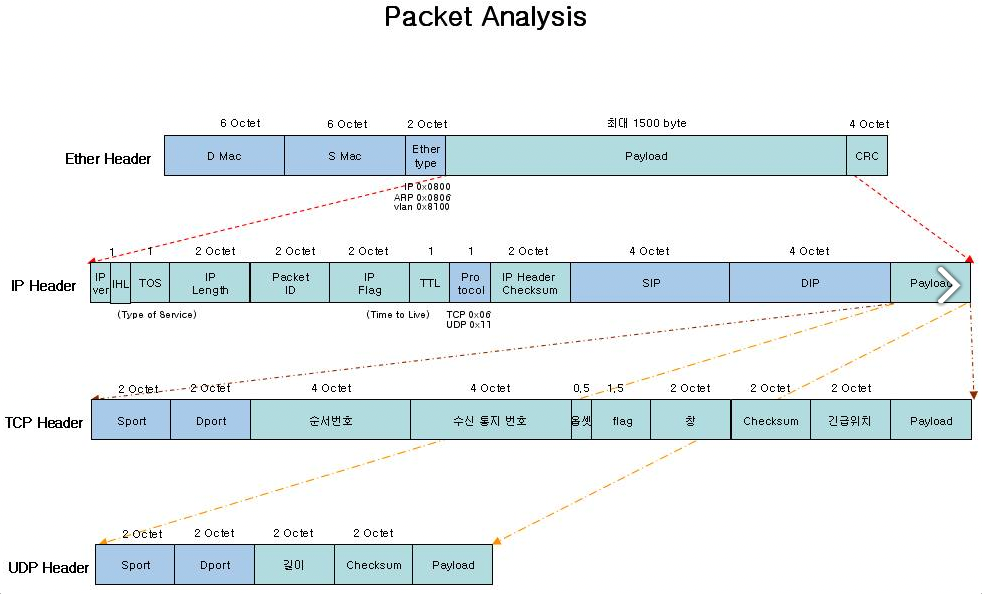

# 3장: 네트워크의 공통 언어 TCP/IP

### 개요

이번 장에서는 TCP/IP에 대해서 알아봅니다.

---

### TCP/IP

- 최근 일반적으로 사용하는 아키텍쳐는 대부분 TCP/IP입니다. TCP,IP를 주축으로 하는 프로토콜의 집합으로 이를 통해 네트워킹하는 기기 전반을 **Host(호스트)**라고 부릅니다.

---

### 각 계층에 대해서 알아보기

- 네트워크 인터페이스층은 동일한 물리 네트워크 안에서 데이터를 전송하기 위해 존재합니다. 일반적으로 하나의 네트워크는 **라우터와 L3스위치 혹은 L2스위치로 묶여있는 범위**를 뜻합니다.
    - 예를 들어 PC, 노트북 등 여러 기기들이 L2 스위치에 연결되어 있다면 이 기기들과 L2 스위치를 묶어 하나의 네트워크라고 표현합니다.
- 세상엔 하나의 네트워크만 있지 않죠. 여러 기기들이 L2 스위치로 묶여있는 네트워크들이 여러 개 존재합니다. 이런 다른 네트워크들끼리 데이터를 전송하기 위해 필요한 것이 바로 **인터넷층**입니다.
    - 각 네트워크들은 **라우터**를 통해 다른 네트워크와 연결되어 데이터를 주고 받습니다. 이렇게 라우터를 통해 네트워크 간 데이터를 전송하는 행위를 **라우팅**이라고 합니다.
    - 원격지 네트워크에서 출발점과 목적지 사이의 데이터 전송을 우린 **엔드투엔드 통신**이라고 부릅니다. 엔드포인트와 엔드포인트라고도 볼 수 있겠네요.
        - 이 때 인터넷 계층에 포함되는 프로토콜은 IP, ICMP, ARP입니다. IP는 목적지 엔드포인트의 통신에 이용되고 ICMP는 이 중 장애가 발생했는지를, ARP는 네트워크 인터페이스 레이어에서 IP 실제 물리적 위치가 어딘지를 알아내기 위해 사용됩니다.
- 우리는 대게 하나의 애플리케이션만 사용하진 않습니다. 크롬으로 웹 서핑을 하면서 유투브로 음악을 듣고 카카오톡으로 메신저를 하죠. 이렇듯 하나의 기기는 여러 애플리케이션에 필요한 데이터를 전달받습니다. 트랜스포트층은 데이터를 각 애플리케이션에 적절하게 배분하기 위해 존재합니다.
    - 트랜스포트층에는 TCP, UDP 프로토콜이 존재하는데요. TCP 프로토콜은 데이터가 유실될 경우 반드시 이 사실을 검출해 데이터를 재전송해줍니다. 이것은 시퀀스 번호와 ACK라는 것을 통해 가능한데요. 뒤에서 좀더 자세히 알아보겠습니다.
- 애플리케이션층의 역할은 애플리케이션이 제 기능을 수행할 수 있도록 데이터 형식과 처리 절차를 결정합니다. 웹 사이트에 필요한 데이터들은 HTTP 프로토콜을 통해서, 메일은 SMTP나 POP3를 통해서 정상적으로 전송됩니다.
    - 모든 프로토콜이 애플리케이션에서 사용되진 않습니다. DHCP, DNS는 애플리케이션의 통신 준비 단계를 위한 프로토콜입니다.

---

### 데이터는 어떻게 송수신 되는가?

- 다른 기기에 있는 애플리케이션끼리 데이터를 교환하기 위해선 송신 측에서 애플리케이션층부터 네트워크 인터페이스층까지 순서대로 통과하여 각 프로토콜에 맞게 처리된 뒤 다시 역순으로 통과하게 됩니다. 이 때 각 프로토콜 별로 적절하게 제어하기 위해 정보가 필요합니다. 이러한 정보들을 우린 **제어 정보**라고 부르고 이런 정보를 **헤더**에 담습니다.
    - 이렇게 제어 정보를 담은 헤더를 층별로 이어 붙이는 행위를 캡슐화라고 부릅니다. 역으로 떼어낼 때는 역캡슐화라고 부릅니다.
- 최초 전달하는 애플리케이션 데이터에서 층별로 헤더들이 붙습니다. 애플리케이션 층에서는 **HTTP 헤더**, 트랜스포트층에서는 **TCP 헤더**, 인터넷층에서는 **IP 헤더**, 네트워크 인터페이스층에서는 **이더넷 헤더**와 데이터의 오류 여부를 판단하기 위한 **Frame Check Sequence(FCS)**가 붙습니다. 이렇게 각 층의 헤더가 전부 붙은 프레임 데이터는 네트워크 인터페이스를 지나며 물리적인 신호로 변환되어 전송 매체로 전송됩니다.
- 데이터가 전송될 때는 네트워크를 구성하는 기기들을 거쳐 전송되게 됩니다. 이 때 기기들이 참조하는 헤더의 종류는 다음과 같습니다.
    - 같은 물리적 네트워크에서의 통신을 위한 L2 스위치는 이더넷 헤더를 참조합니다.
    - 다른 네트워크와의 통신을 위한 라우터는 IP 헤더를 참조합니다.
    - 역시 다른 네트워크와의 통신을 위한 L3 스위치는 이더넷 헤더와 IP 헤더를 둘다 참조합니다.
- 데이터를 전달받은 측에서 어떤 일들이 이뤄지는지 개략적으로 살펴보겠습니다.
    - 네트워크 인터페이스 층에서는 이더넷 헤더를 참조해 자신이 목적지가 맞는지 확인합니다. 또한 FCS를 참조하여 데이터에 오류가 없는지 체크합니다. 이더넷 헤더와 FCS가 역캡슐화되어 사라진 데이터는 상위 층인 인터넷 계층으로 올라갑니다.
    - 인터넷 계층에서는 IP 헤더를 참조해 다시 한번 자신이 목적지가 맞는지 확인합니다. 맞다면 역캡슐화를 통해 IP 헤더를 떼내어버리고 상위 층인 트랜스포트층으로 데이터를 넘깁니다.
    - 트랜스포트층에서 TCP는 TCP 헤더를 참조해 자신이 전달한 애플리케이션을 확인하고 시퀀스 번호 등을 확인해 데이터가 정상적으로 전달되었는지 체크합니다. 이 후 HTTP 헤더와 데이터가 남은 데이터를 애플리케이션 층에 넘깁니다.

---

### 각 계층에서 데이터를 부르는 단위

]

[https://karfn84.tistory.com/entry/network-패킷-구조-ether-tcp-ip-header#recentComments](https://karfn84.tistory.com/entry/network-%ED%8C%A8%ED%82%B7-%EA%B5%AC%EC%A1%B0-ether-tcp-ip-header#recentComments)

- 웹 브라우저를 통해 다른 사이트에 접속하는 경우를 가정해봅시다. 이 때 애플리케이션 층에는 웹 브라우저의 데이터와 HTTP 헤더가 들어갑니다. 이를 **HTTP 메시지**라고 합니다. 즉 애플리케이션에서는 헤더가 추가된 데이터를 메시지라고 합니다.
- HTTP 메시지는 특정 크기로 잘려서 트랜스포트층으로 내려가는데요. 이 때 TCP 헤더가 붙는 경우는 세그먼트, UDP 헤더가 붙는 경우는 **데이터그램**이라고 부릅니다.
- 트랜스포트층에서 내려온 데이터는 IP 헤더가 붙고 이것이 우리에게 익숙한 **패킷**이 됩니다.
- 마지막으로 패킷은 네트워크 인터페이스 층에서 이더넷 헤더와 FCS를 좌우로 붙히는데 이를 **프레임**이라고 부릅니다.

---

### IP란 왜 필요할까요?

- 인터넷층에서의 프로토콜 IP에 대해서 자세히 알아봅시다. IP는 Internet Protocol의 약자로 엔드투엔드 통신, 즉 **기기에서 다른 기기로 데이터를 전송하는 것**이 주된 목적입니다. 이 때 각 엔드포인트의 네트워크는 달라도 상관 없습니다.

---

### IP 주소는 어떻게 생겼을까요?

- 우리는 택배를 보낼 때 도, 시, 군 등의 지역정보를 통해 목적지를 명시합니다. 네트워크에서는 무엇으로 목적지 주소를 명시할까요? 바로 **IP Address**입니다. IP 주소는 통신 상대인 호스트를 식별하기 위한 정보로써 TCP/IP에서 반드시 지정되어야 하는 데이터입니다.
    - IP 주소는 이더넷 등의 인터페이스와 연관지어져 설정됩니다. IP 프로토콜은 호스트의 OS에서 동작합니다. 따라서 호스트 내부에서는 네트워크 인터페이스와 IP 프로토콜을 연관지어 IP 주소를 설정합니다.
        - 다만 IP 주소는 호스트와 일대일로 매핑되지 않을 수도 있습니다. 노트북의 경우 유선 이더넷과 무선 LAN 인터페이스가 같이 탑재된 경우가 많기 때문에 인터페이스별로 IP 주소 설정이 가능합니다. 따라서 IP 주소는 정확히는 호스트가 아닌 호스트의 인터페이스를 식별합니다.
    - IP 주소는 32비트로 이루어져 있습니다. 이는 주로 8비트씩 나눠져 10진수로 변환되어 표기됩니다. 8비트는 최대 256의 값을 가질 수 있기 때문에 나눠진 4개의 10진수가 255가 넘는 IP 주소는 **잘못된 주소**입니다. 이러한 표기법을 도트형 10진 표기라고 부릅니다.
- IP 주소는 **네트워크부**와 **호스트부**로 구성되어 있습니다. 그 이유는 우리는 다른 네트워크에 연결된 엔드포인트도 통신하기 때문이죠. 앞의 네트워크부로는 라우터와 L3 스위치로 연결된 네트워크들을 이동할 때 네트워크를 식별하고 식별된 네트워크의 호스트 인터페이스는 뒷부분의 호스트부로 식별합니다.
    - 브로드캐스트를 할 때 IP 주소는 32비트가 모두 1입니다.
    - 멀티캐스트는 224.0.0.0 부터 239.255.255.255 사이로 주소 범위가 정해져 있습니다. 이 범위 중 일부 주소들은 미리 정해져 있습니다. 예를 들어 224.0.0.2라는 멀티캐스트 IP 주소는 ‘같은 네트워크 상의 모든 라우터'를 뜻하는 그룹입니다.
- IP 주소의 네트워크부와 호스트부의 부분은 가변적입니다. 네트워크부와 호스트부가 차지하는 비트의 크기가 달라진다는 말이죠. 각 부를 명시한 것이 바로 **서브넷 마스크**입니다. 서브넷 마스크에서 1은 네트워크, 0은 호스트를 의미합니다.
    - 호스트부를 모두 비트 ‘0’으로 채우는 경우는 네트워크 자체를 식별하기 위한 네트워크 주소가 됩니다.
    - 서브넷 마스크는 네트워크부의 위치만 표시하기 때문에 IP 주소를 표시하진 못합니다. 둘을 동시에 표기하는 표기법에는 **CIDR 표기법**이 있습니다.
        - ex. 192.168.0.1/16 → 16비트까지는 네트워크 주소이고 나머지가 호스트 주소라는 의미입니다.

---

### IP 헤더는 어떻게 생겼을까요?

- 인터넷층에서는 캡슐화된 데이터에 IP헤더가 추가로 붙었었습니다. IP의 목적이 데이터의 전송인만큼 **출발지와 목적지**가 가장 중요한 정보입니다. IP헤더는 아래처럼 생겼습니다.
    

    
    - 위 사진에서 **Source address**가 출발지 IP 주소, **Destination address**가 목적지 IP 주소입니다.
    - 헤더에 대해서 좀더 알아보겠습니다. IP 헤더는 주로 20바이트의 크기를 갖습니다. 한 줄은 총 32비트로 한 줄에 4바이트씩을 차지하며, 이것이 5줄이 존재합니다. 따라서 4 * 5, 총 20바이트가 됩니다. 각 세부 요소는 어떤 의미를 갖는지 확인해보겠습니다.
        1. **Version(4bit)**: IP 프로토콜의 버전을 의미합니다. IPv4는 4, IPv6는 6의 값을 갖습니다.
        2. **IHL(Internet Header Length,4bit)**: IP 헤더의 길이를 32비트 단위로 나타냅니다. 주로 20바이트(160비트)의 크기를 갖기 때문에 대부분 5의 값을 가집니다.
        3. **TOS(Type of service)** : 대역폭의 품질을 관리할 때 들어가며 IP 패킷의 전달 우선순위를 뜻합니다.  값은 0부터 15까지 존재합니다.
        4. **Identification** : 패킷은 평균적으로 최대 크기(MTU)를 1500바이트로 가집니다. 이 때 MTU보다 크기가 큰 경우 이를 MTU보다 작게 자르게 되는데 이를 단편화라고 합니다. 이 필드는 단편화(fragmentation)가 일어났을경우 단편화된 각 데이타그램을 구분할수 있는 일련의 번호를 뜻합니다.
        5. **TTL(time to live) :** 데이터그램이 유지되는 시간입니다. 라우터를 지나갈 때마다 감소하는 값으로써 1씩 감소합니다. 총 8bit로 구성되어 있기 때문에 들어갈 수 있는 최대 255의 값을 가질 수 있습니다. 이는 최대 라우터를 255번 지날 수 있다는 의미입니다. 라우터는 이 값이 0이 될 경우 패킷을 폐기합니다. 이를 명시하는 이유는 데이터가 라우터 상에서 무한으로 순환하는 상황을 막기 위해서입니다.
        6. **Protocol:** L4 계층이 TCP인지 UDP인지를 의미합니다.

---

### 공인 IP 주소와 사설 IP 주소

- IP 주소는 어느 네트워크에서 이용하느냐에 따라 공인 IP 주소(퍼블릭 IP)와 사설 IP 주소로 나눠집니다. 공인 IP는 인터넷에서 이용하는 주소로써 인터넷에서 통신하기 위해서 꼭 필요합니다. 사설 IP는 사내 네트워크에서 사용하는 IP로써 네트워크가 다르다면 겹쳐도 괜찮습니다.
    - 공인 IP 주소는 거대한 인터넷에서 사용하고 자신의 식별자인만큼 중복되선 안됩니다. 또한 인터넷 접속 서비스를 계약해야만 공인 주소가 할당됩니다.
    - 사설 주소는 말 그대로 우리끼리만 사용하는 주소이며 아래의 범위를 가지는 주소는 모두 사설 IP 주소입니다.
        - 10.0.0.0 ~ 10.255.255.255
        - 172.16.0.0 ~ 172.31.255.255
        - 192.168.0.0 ~ 192.168.255.255
    - 사설 네트워크에서 인터넷과 통신하기 위해선 자신이 사용하는 사설 IP 주소를 공인 IP 주소로 변환해야 합니다. 이 때 사용하는 것이 바로 **Network Address Translation, NAT**입니다.
        - 물론 출발지를 사설 IP 주소로 설정해도 요청은 가능합니다. 다만 응답이 도달하지 않아 통신이 되지 않습니다. 인터넷에서는 목적지가 사설 주소인 IP 패킷이 폐기되기 때문입니다.
        - NAT는 아래와 같은 순서로 인터넷으로 통신합니다.
            1. 사설 네트워크에서 인터넷으로 요청할 때 사용자는 NAT 장비에게 “나 인터넷으로 나가고싶어”라고 요청합니다. NAT 장비는 요청의 출발지에 담겨있는 사용자의 사설 IP를 **인터넷과 연결되어 있는 자신의 공인 IP로 변경**해줍니다.
            2. 변경된 출발지를 가지고 목적지 IP로 요청을 전송합니다. 이 때 NAT 장비는 **자신이 변환한 사설 IP 주소와 목적지 주소의 매핑**을 NAT 테이블에 기억합니다.
            3. 요청에 대한 응답이 돌아오면 응답의 IP와 매핑된 사설 IP 주소로 응답을 전송합니다.
        - 하지만 이 경우 사설 IP와 공인 IP를 일대일로 매핑시키기 때문에 사설 IP의 여러 사용자(애플리케이션)이 요청한 경우 어떤 사용자가 매핑된 것인지 알 수 없습니다. 따라서 이 땐 NAT 장비가 변환하는 사용자의 포트까지 임의로 변경해 저장합니다. 이를 **Network Address Port Translation, NAPT**라고 합니다. 이 때 변환된 포트 번호는 이 용도로만 사용됩니다.

---

### IP의 데이터 전송 방식

- IP를 통해 데이터를 전송할 때 목적지의 수는 중요하지 않습니다. 다만 목적지의 수에 따라 우린 데이터 전송 방식을 나눠서 부릅니다. 한 곳으로만 보낼 때에는 **유니캐스트**, 같은 네트워크 상의 모든 호스트에게 보낼 때에는 **브로드캐스트**, 특정 그룹에게만 보낼 때에는 **멀티 캐스트**라고 부릅니다. TCP/IP 통신의 대부분은 유니캐스트입니다.
    - 유니캐스트는 우리가 흔히 사용하는 웹 서핑에 사용됩니다. 한 곳에서 한 곳으로만 데이터를 전송하니까요. 그런데 브로드캐스트와 멀티 캐스트는 왜 필요한 걸까요? 그냥 하나씩 여러 번 보내면 되지 않을까요?
        - 물론 보낼 수 있지만 효율이 좋지 않습니다. 따라서 **완전히 똑같은 데이터를 여러 곳에 효율적**으로 보낼 때에는 브로드캐스트와 멀티캐스트를 사용합니다.

---

### IP는 Best effort합니다.

- IP는 데이터를 전송하긴 하지만 제대로 도착하는지를 확인하진 않습니다. 이런 IP의 특징을 최선형(best effort)라고 합니다. 따라서 **IP 통신이 정상적으로 이뤄졌는지를 확인하는 Internet Control Message Protocol, ICMP**이 개발됐습니다.
    - 만약 IP 패킷이 폐기되는 경우 폐기한 기기는 ICMP를 통해 출발지로 에러 리포트를 전송합니다. 이를 **도달불능 메시지**라고 합니다. 이 메시지에는 통신에 실패한 원인이 담겨있습니다.
    - 또 다른 기능으로는 통신 가능 여부를 체크하는 **진단 기능**입니다. 일반적으로는 ping 명령어가 대표적입니다.

---

### ARP

- IP 주소는 사실 네트워크 상의 주소입니다. 즉 언제든지 변할 수 있다는 것이죠. 예를 들어 내가 미국에 사는 샐리에게 편지를 전달하고 싶을 때 우린 동네 우체국을 거치고 우체국은 공항을 거치고 공항에선 다시 샐리네 우체국을 거친 뒤 샐리에게 편지를 전달하게 됩니다. 여기서 샐리는 IP 주소이고 우체국, 공항은 MAC 주소에요. 결국 우린 샐리에게 편지를 보내기 위해선 우체국과 공항 주소, 즉 MAC주소를 먼저 식별해야 합니다. 이 때 ‘샐리'라는 IP 주소만 가지고 어떤 우체국과 공항(MAC 주소)를 거쳐야 하는지 알 수 있게 해주는 것이 바로 **ARP(Address Resoultion Protocol)**입니다.
    - 즉 IP 주소와 대응하는 MAC 주소를 찾기 위해 필요한 것이 ARP이며, ARP를 통해 IP주소와 MAC 주소를 대응시키는 것을 우린 **주소 해석**이라고 합니다.
- ARP의 주소 해석 범위는 같은 네트워크 안의 IP입니다. IP 패킷을 송신하기 위해 목적지 IP 주소를 지정할 때 ARP가 수행됩니다. 왜냐면 물리적인 주소가 어딘지 알아야 보낼 수 있으니까요. ARP의 주소 해석 동작 흐름은 아래와 같습니다.
    1. ARP 요청을 같은 네트워크 안에 보내고자 하는 IP 주소 192.168.1.3의 MAC 주소를 아는 호스트가 있는지 브로드캐스트합니다. 
    2. 브로드캐스를 받은 기기 중 해당되지 않는 기기에서는 수신한 요청을 폐기하고 대응되는 기기는 “그거 나야" 라고 응답한 뒤 자신의 ARP 캐시에 수신한 기기의 IP주소와 MAC 주소의 매핑을 ARP 캐시에 저장합니다.
    3. 응답을 돌려받은 송신측 피씨는 보내려고 하는 MAC 주소가 어딘지 알았으니 목적지 IP 주소를 저장하고 본인의 ARP 캐시에 수신측 기기의 IP 주소와 MAC 주소 매핑을 저장합니다.
    - 관련된 자세한 내용은 5장에서 살펴보도록 하겠습니다.

---

### Port

- 우리 PC에는 여러 애플리케이션들이 동작합니다. 그리고 이들에게 데이터를 배분하기 위해선 식별자가 필요하죠. 여기서 애플리케이션을 식별하기 위한 임시 식별자가 바로 **포트 번호**입니다. 이는 데이터를 각 애플리케이션에 할당하기 위한 것입니다. 즉 트랜스포트층에 해당하죠. 따라서 포트는 TCP 혹은 UDP 헤더에 지정됩니다.
    - 포트 번호는 16비트 범위를 갖고 있기 때문에 0부터 65535까지를 사용합니다.
        - 0부터 1023까지는 웰노운 포트라고 하여 미리 예약된 포트를 말합니다. 80(HTTP), 443(HTTPS), 25(SMTP), 110(POP3), IMAP4(143), FTP(20,21), DBCP(67,68-UDP) 등이 있습니다.

---

### TCP의 데이터는 믿을만해

- IP는 최선을 다했지만 도착하지 못했다면 어쩔 수 없지라는 best effort ****마인드셋을 갖고 있었습니다. 이런 IP의 단점을 보완하기 위해 TCP는 **Sequence Number와 Ack Number를 통한 신뢰성 있는 데이터 전송을 보장**합니다. 또한 데이터 수신자의 버퍼에 오버플로우를 방지해주는 **데이터 흐름 제어** 및 네트워크 내에 패킷 수가 과도하게 증가하는 현상을 방지하는 **혼잡 제어**도 가능합니다. 하지만 너무 느리다는 치명적인 단점이 있습니다.
- TCP는 데이터 통신을 시작하기 전 반드시 아래와 같은 절차를 가집니다.
    1. **TCP 커넥션 맺기**
        - 클라이언트 A는 서버 B와 TCP 커넥션 연결을 위해서 3 way handshake를 진행합니다. 통신 시 교환되는 데이터의 단위는 세그먼트입니다.
            1. A는 B에게 처음 날아갈 때는 **SYN(1000, A의 시퀀스 넘버) 플래그 비트가 담긴 세그먼트**를 전송합니다. A는 전송 후 SYN을 전송한 **SYN-SENT 상태**가 됩니다.
            2. B는 SYN을 받으며 “잘받았어” 하고 전달받은 시퀀스 번호에 1을 더한 **ACK(1001)**와 자신의 시퀀스 번호를 담은 **SYN(4000)**이 합쳐진 플래그 비트를 설정한 세그먼트를 A에게 다시 전송합니다. 서버는 SYN을 수신한 **SYN-RECEIVED 상태**가 됩니다.
            3. A는 수신 후 “오케이, 나도 잘받았어" 하고 B의 시퀀스 번호에 1을 더한 **ACK(4001)**를 설정한 세그먼트를 다시 전송합니다. 
            4. 3번 과정이 완료되면 둘은 실제 데이터 전송을 수행할 수 있는 **ESTABLISHED 상태**가 됩니다. 
        - 3번부터는 요청을 송신하고 응답받는데에 걸리는 시간 **RTT, Round Trip Time**를 계산할 수 있습니다. 3 way에서 두 번째 과정까지는 클라이언트와 서버가 서로 처음 세그먼트를 보내기 때문에 RTT를 구할 수 없습니다. 따라서 마지막 ACK에서 RTT의 계산이 가능해지는데 리눅스에서는 InitTRO라는 임의의 값을 통해 계산할 수 있습니다.
        - 결국 TCP 커넥션 연결은 시퀀스 넘버를 교환하는 행동입니다. 이 때 Maximum segment size도 교환하게 되는데, 만약 서로 MSS가 다르다면 낮은 쪽에 맞춰 하향 평준화됩니다.
    2. 소켓 통신을 통한 애플리케이션 간 데이터 송수신
    3. TCP 커넥션 끊기
        - TCP 소켓 통신의 해제를 위해선 4 way handshake를 진행합니다. 위 과정에서는 먼저 연결을 해지하고자 하는 쪽이 먼저 신호를 전송합니다. 연결 해제를 요청한 쪽을 Active Closer, 수신한 쪽을 Passive Closer라고 명시하겠습니다.
            1. Active Closer(A)에서 Passive Closer(B)에게 “연결 그만 끊자” 라고 말하며 **FIN(1000, A의 시퀀스 넘버) 세그먼트**를 전달합니다. Active Closer는 전송 후 Passive Closer의 응답을 기다리는 **FIN-WAIT1 상태**가 되고 요청을 받은 Passive Closer는 **CLOSE-WAIT1 상태**가 됩니다.
            2. FIN을 받은 Passive Closer(B)는 “알겠어 소켓 통신 끊을게"라고 말하며 **ACK(1000+1, A의 시퀀스 넘버+1)**을 응답합니다. ACK를 받은 Active Closer(A)는 Passive Closer(B)가 소켓을 정상적으로 종료했다는 내용을 수신할 때까지 **FIN-WAIT2 상태**를 유지합니다.
            3. Passive Closer(B)가 정상적으로 소켓이 종료되면 “소켓 다 끊었어"라고 말하며 자신의 시퀀스 넘버를 담은 **FIN(4000)**을 보냅니다. Passive Closer(B)는 Active Closer(A)가 대답만 해주면 연결을 끊을 수 있습니다. 이 때부터는 **LAST-ACK 상태**가 됩니다. 만약 Active Closer(A)로부터 대답을 못듣는 경우 **TIME-WAIT 상태**에서 일정 시간을 기다리다가 “끊겼겠지 뭐"하고 소켓을 종료합니다.
            4. Passive Closer(B)로부터 FIN을 받은 Active Closer(A)는 “소켓 종료 확인” 이라고 말하며 전달받은 시퀀스 넘버에 1을 더한 마지막 **ACK(4001)**를 보내며 통신이 완전히 종료됩니다.
- 위 통신 과정을 잘 살펴보시면 계속 SYN 혹은 ACK에 특정 번호를 담아 세그먼트를 전송합니다. 여기서 보내는 시퀀스 번호는 TCP 세그먼트를 통해 전송되는 잘려진 데이터의 순서를 의미하고, ACK 번호는 전달한 데이터를 올바르게 수신했음을 의미합니다.
    - 그래서 시퀀스 번호 4000을 보내면 ACK으로 시퀀스 번호+1의 번호를 담아보냈던 것이죠.
    - 앞서 TCP에서는 잘려진 데이터를 보낸다고 했는데 잘려지는 기준은 뭘까요? 바로 **Maximum Segment Size, MSS**입니다. MSS의 표준 크기는 1460바이트입니다.
    - MSS에 맞춰 잘려진 데이터 **1460바이트**에 TCP 헤더 **20바이트**, IP 헤더 **20바이트**가 더해지면 우리가 앞에서 얘기했던 IP 패킷의 **최대 사이즈(MTU) 1500바이트**가 되는 것입니다.

---

### UDP

- UDP는 연결지향형인 TCP와는 다르게 비연결형입니다. 그리고 IP처럼 데이터의 신뢰성에 큰 의미를 두지 않습니다. UDP는 정보를 주고 받는 신호는 핸드쉐이크도 거치지 않으며 CheckSum 필드를 통해 최소한의 오류만 검출합니다. 하지만 이 때문에 패킷 손실의 가능성이 존재하며 신뢰성이 낮습니다. 대신 연결을 수립하는 시간이 필요한 TCP와 비교해서 훨씬 빠릅니다.
    - HTTP 2.0은 빠른 속도를 위해 UDP 기반에서 동작합니다.
    - 또한 TCP처럼 데이터를 사이즈에 맞춰 작게 자르지도 않습니다.
    - 신뢰성보다는 연속성이 중요한 IP 전화나 스트리밍, 브로드캐스팅에서 사용됩니다.

---

### DNS

- 우리 중 네이버에 접속할 때 혹시 공인 IP 주소를 입력하며 접속하는 사람이 있나요? 대부분 [www.naver.com](http://www.naver.com) 이라는 영어를 입력하고 접속합니다. IP 주소는 숫자로 이뤄져있고 사람들이 외우기 어렵기 때문에 서버는 사용자가 이해하기 쉬운 이름, 호스트명을 붙혀 IP 주소와 호스트명을 매핑합니다. 매핑된 호스트명과 IP 주소의 대응관계를 우린 **리소스 레코드**라고 부르며 이를 관리하고 알려주는 것이 바로 **DNS**의 역할입니다. 이렇게 호스트명에서 IP 주소를 얻어내는 방법을 **이름 해석**이라고 합니다.
- DNS의 이름 해석은 어떻게 동작할까요? www.naver.com을 입력했다고 가정하고 동작 순서를 확인해보겠습니다.
    1. www.naver.com이 웹 브라우저의 주소창에 입력되면 제일 먼저 DNS Cache를 탐색합니다.
    2. 만약 없다면 기기 내의 hosts 파일을 탐색합니다.
    3. 공유기가 DNS 포워딩을 하기도 하고, 만약 하지 않는다면 ISP가 제공하는 Cache DNS에 질의합니다. 여기서 DNS 서버에게 질의하는 기능을 **DNS 리졸버**라고 부르며 이는 OS에 내정되어 있습니다.
        1. Cache DNS는 자신이 아는 도메인이라면 즉시 알려주지만, 만약 모른다면 다른 DNS에게 묻게 되는데 이때 질문을 받는 DNS가 바로 Root DNS입니다. DNS는 최상위 루트 네임 서버부터 계층적으로 구성되어 있습니다.
        2. Root DNS는 *.com을 다루는 DNS 목록을 넘겨줍니다.
        3. 그럼 여기서 제일 가깝거나 좋은 성능을 내는 DNS를 하나 골라서 [www.naver.com](http://www.naver.com)을 아느냐고 다시 묻습니다.
        4. 이 중 상위 DNS가 “응! 알어!”라고 대답하며 그리고 네이버 쪽을 다루는 하위 DNS를 다시 알려줍니다. 이렇게 계층을 타고 내려오며 이름 해석을 반복해서 묻는 것을 **재귀질의**라고 합니다. 하지만 이렇게 매번 루트에게 묻는 것은 효율적이지 않으므로 한동안 특정 공간에 저장해놓게 되는데 이것이 **DNS Cache**입니다. 
        5. 그리고 우린 DNS에게 “[www.naver.com](http://www.naver.com) 알고 있어?”라고 묻습니다.
        6. 해당 DNS에게 IP 주소가 있다면 이를 전달받아 접속할 수 있게 됩니다.

### *Ref*

- [https://aws-hyoh.tistory.com/145](https://aws-hyoh.tistory.com/145)
- [https://brunch.co.kr/@dreaminz/5](https://brunch.co.kr/@dreaminz/5)