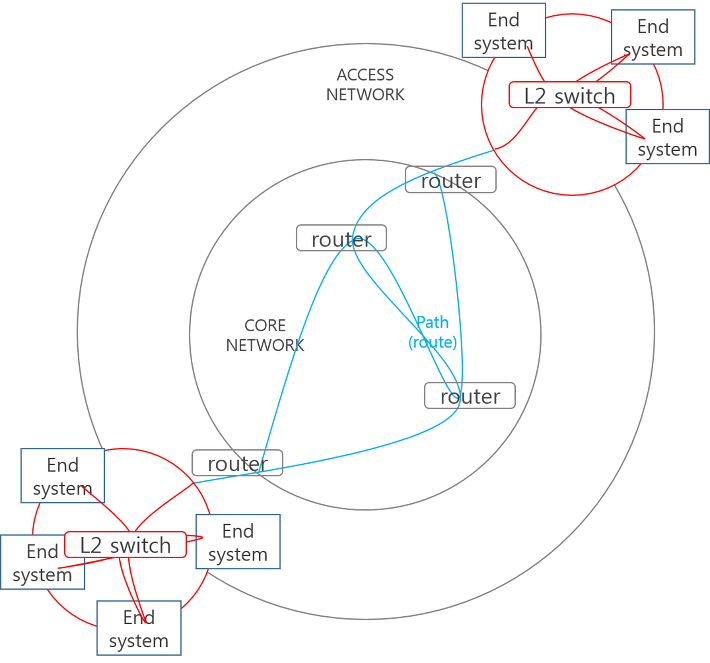

# 5장: 이더넷과 무선 LAN

### 개요

네트워크 인터페이스층을 구성하는 이더넷과 무선 LAN(Wi-fi)에 대해서 알아봅니다.

---

### 같은 네트워크 내에서의 전송을 반복한다

- 네트워크는 기술적인 관점에선 라우터 또는 L3 스위치로 구획되는 범위입니다. 구획이란 ‘경계를 갈라 범위를 정한 구역'이라는 뜻을 갖습니다. 즉 라우터 또는 L3 스위치가 기준이 되어 경계를 나눈 범위를 나눈 것입니다. 즉 라우터와 라우터 사이의 범위가 하나의 네트워크라는 뜻이죠.
    - 네트워크의 기본적인 구성은 **L2 스위치를 기준으로 하나의 네트워크를 구성**하고, **라우터 또는 L3 스위치로 여러 개의 네트워크를 서로 연결**하는 것입니다.
        
        

        
    - 이는 다른 네트워크에 전송하는 것이 결국 하나의 네트워크 안에서 다른 네트워크와 연결된 지점까지 네트워크 내에서의 통신을 반복하는 것와 같다는 의미입니다.
        - 다른 네트워크에 존재하는 서버에 도달하고 싶은 클라이언트는 우선 자신의 네트워크 내에 있는 라우터에게 데이터를 전송하고합니다. 데이터를 전달받은 라우터는 자신과 연결된 다른 네트워크의 다음 라우터에게 데이터를 전송하는 것이죠.
    - 이렇게 동일한 네트워크 안에서 전송할 때 일반적으로 사용되는 프로토콜로 바로 이더넷과 무선 LAN(Wi-Fi)입니다.
- 이더넷을 기억할 때 가장 중요한 것이 있습니다. 이더넷은 기본적으로 L2 스위치로 연결된 **같은 네트워크 상의 다른 인터페이스**에게 데이터를 전송합니다. 데이터의 전송 범위가 같은 네트워크라는 점입니다.
    - VLAN 기능을 사용하면 같은 L2 스위치에 연결되어 있어도 다른 네트워크처럼 다룰 수 있지만 기본적인 정책은 위와 같습니다.
    - 이 때 스위치는 전송되는 데이터에 전혀 변경을 가하지 않습니다.
- 같은 네트워크라도 데이터를 전송하려면 역시 출발지와 목적지가 필요합니다. 이더넷에선 각자의 인터페이스를 식별하기 위해 **MAC 주소**를 사용합니다.
    - MAC 주소는 총 48비트로 이뤄집니다. 이너뎃 인터페이스를 제조하는 벤더의 식별 코드 24비트와 자신만의 식별자인 시리얼 번호 24비트로 이뤄집니다.
    - 기본적으로 MAC 주소는 인터페이스에 할당되어 변경할 수 없는 주소입니다.

---

### 이더넷의 프레임은 어떤 구조일까요?

- 앞서 살펴본 데이터 단위에서 이더넷은 Frame이라는 단위를 사용했습니다. 여기에는 상위 층의 데이터에 이너뎃 헤더와 FCS가 붙은 구조였죠. 이 둘에는 어떤 데이터가 들어가있는지를 확인해보시죠.
    - 이더넷 헤더에는 목적지 MAC 주소와 출발지 MAC 주소, 타입 코드가 들어있습니다. 이 중 타입 코드는 프레임에 담겨있는 본문 데이터가 어떤 타입인지를 명시합니다. 일반적인 경우 TCP/IP를 사용하므로 IPv4를 나타내는 0x0800를 갖습니다.
        - IPv4: 0x0800
        - IPv6: 0x86DD
        - ARP: 0x0806
- 프레임은 트랜스포트층의 TCP가 갖는 MSS처럼 전송하는 데이터의 크기 제한을 갖습니다. 이를 Maximum Transmission Unit, MTU라고 부릅니다. 이는 **64바이트에서 1500바이트 사이**로 정해져 있습니다. 그런데 1500바이트 뭔가 수의 범위가 익숙해보입니다.
    - MSS가 1460바이트였던걸 기억하시나요? 우리는 트랜스포트층에서 인터넷층, 그리고 이더넷층까지 총 2개의 층을 추가로 내려왔습니다. 즉 층을 내려오며 우리가 붙힌 헤더는 TCP, IP 헤더로 총 2개입니다. 그렇다면 이 둘의 크기의 합이 1500-1460=40바이트라는 의미죠.
        - 네 맞습니다. 프레임의 최대 크기인 MTU가 1500바이트인 이유는 MSS 1460바이트의 20바이트 크기를 갖는 헤더 2개가 추가로 붙었기 때문입니다.
        - 여기에 추가적으로 이더넷 헤더와 FCS까지 붙게 되면 이더넷 프레임은 64~1518바이트 범위의 크기를 갖습니다.

---

### 이더넷의 구조

- 이더넷은 L2 스위치를 기준으로 구획된다고 얘기했습니다. 그렇다면 어떤 모양으로 묶이는 걸까요? 친목 도모를 위해 식당에 사람들이 모였다고 가정해보겠습니다. 만약 이 때 식당의 테이블들이 원형으로 배치되어 있다면 이 네트워크의 모양은 원형이 됩니다. 만약 네모 모양으로 배치되어 있다면 ㅁ모양의 네트워크가 됩니다. 네트워크도 똑같습니다. 어떤 모양으로 네트워크가 형성되는 지에 따라 네트워크의 모양은 달라집니다. 이를 네트워크에서는 ‘토폴로지'라고 말합니다. 일반적으로 네트워크는 3개의 토폴로지를 갖습니다.
    - 가운데 길다란 선이 존재하고 이를 기준으로 각 기기에서 각자만의 선으로 연결하는 **버스형**
    - 하나의 기준점을 가지고 각자 선으로 연결하는 **스타형**
    - 원형의 선을 기준으로 선 위에 매달린(배치된) 형태로 연결되는 **링형**
- 예전 이더넷은 동축 케이블을 전송 매체로 했기 때문에 버스형 토폴로지를 가졌습니다. 버스형 토폴로지는 가운데 존재하는 기다란 선에 데이터 전송을 의지하는 형태입니다. 이더넷에는 이 기다린 선에 데이터가 서로 충돌하지 않도록 CSMA/CD라는 방식을 이용했습니다. 현재는 버스형에서 L2 스위치가 기준점이 되는 **스타형 토폴로지**로 옮겨가고 있습니다.
    - 데이터의 전송을 제어하는 방법인 CSMA/CD는 Carrier Sense Multiple Access with Collision Detector의 약자입니다. 간단하게는 ‘먼저 가는 쪽이 승리'합니다.
    - 여기서 Carrier Sense는 현재 케이블이 사용중인지를 감지하는 것을 말합니다. 만약 케이블이 사용중이라면 대기하고 비었다면 신호를 전송합니다. 하지만 다른 쪽에서도 비어있다는 것을 감지할 수 있기 때문에 동시에 신호를 전송해버리면 기다린 선에서 서로 충돌해 모두 피해를 봅니다. 따라서 무작위로 기다린 뒤 데이터를 전송하는 방식을 취합니다.
        - 하지만 이 미말했듯 이더넷은 현재 버스형 토폴로지가 아니기 때문에 이 방식이 필요하지 않습니다.

---

### L2 스위치는 데이터를 어떻게 전송할까요?

- L2 스위치가 데이터를 어떻게 전송하는지 살펴보겠습니다.
    1. 스위치 A는 자신이 수신한 이더넷 프레임의 **출발지 MAC 주소 A와 수신 포트 1**을 MAC 주소 테이블에 등록합니다.
    2. MAC 주소 테이블에서 전송할 포트에 전달받은 목적지 MAC 주소가 매칭된다면 해당 포트로 프레임을 전송합니다. 
        - 만약 MAC 주소 테이블에 목적지 주소와 매칭되는 포트가 없다면 자신과 연결된 모든 포트 중 프레임을 수신한 포트를 제외한 모든 포트에 이더넷 프레임을 전송합니다. 이를 **플러딩**이라고 합니다.
        - 이렇게 테이블에 목적지 주소가 존재하지 않는 이더넷 프레임을 **Unknown 유니캐스트 프레임**이라고 부릅니다.
        - L2 스위치도 “아몰랑 내가 연결한 인터페이스 중 하나겠지”라는 마인드셋으로 프레임을 모두에게 전송합니다. 약간 IP의 best effort처럼 무책임하죠.
    3. 이렇게 발송된 프레임은 같은 네트워크 안에 존재하는 다른 L2 스위치 B에게도 도달합니다. 이 L2 스위치도 똑같은 플러딩 작업을 수행합니다. 
        - 프레임에 해당하지 않는 호스트는  “뭐야 얘는" 하며 프레임을 폐기합니다.
    4. B는 우선 수신한 프레임의 MAC 주소와 포트를 MAC 주소 테이블에 저장합니다. 그리고 목적지 MAC 주소와 일치하는 기기 D가 테이블에 존재한다면 해당 포트로 프레임을 보내고 아니라면 동일하게 플러딩을 실시합니다.
        - 만약 일치하는 포트가 존재해 해당 포트로 프레임을 전송하면 해당 기기(호스트) D는 프레임을 수신한 뒤 인터넷층으로 데이터를 올려 상위 프로토콜에서의 절차를 수행합니다.
    5. 요청을 수신했으니 응답을 해야겠죠? 호스트 D는 자신에게 프레임을 보낸 스위치 B에게 응답 프레임을 보냅니다. 
        - B는 똑같이 자신의 주소 테이블에 요청을 수신한 호스트 D와 연결된 포트 2를 기록하고 자신이 해당 프레임을 수신했던 포트로 요청을 되돌려보냅니다. 해당 포트를 통해 맨 처음 요청을 발송한 L2 스위치 A에게 도달하고 A 역시 테이블에 MAC 주소 B와 포트 3을 저장합니다.
        - 요청을 수신한 A는 자신이 받은 프레임의 목적지 MAC 주소 A와 일치하는 포트 1에 프레임을 전송하며 동작이 마무리됩니다.
- 여기서 하나의 포트에 꼭 하나의 MAC 주소만 매칭되는 것은 아닙니다. 여러 대의 스위치가 연결된 경우 테이블에는 하나의 포트에 복수의 MAC 주소가 등록되기도 합니다.
    - 또한 테이블에 저장된 MAC 주소 정보는 영구적이지 않습니다. 일반적으로 5분의 타임아웃을 가진 채 기록됩니다.
- L2 스위치를 기반으로 하는 이더넷 네트워크는 데이터의 송신과 수신을 동시에 수행하는 **전이중 통신 방식**을 사용합니다. 반대의 경우는 반이중 통신이라고 말합니다.
    - 전이중 통신을 위해서 가장 단순하게는 수신용과 송신용의 전송 매체를 나눠서 사용하면 됩니다. 이더넷에서는 총 4(x2)줄로 구성된 UTF 케이블을 사용합니다.