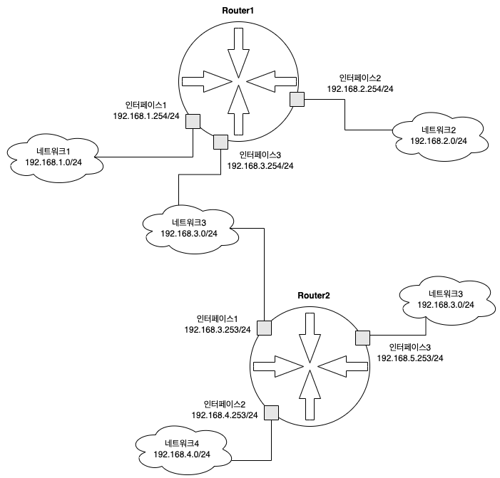
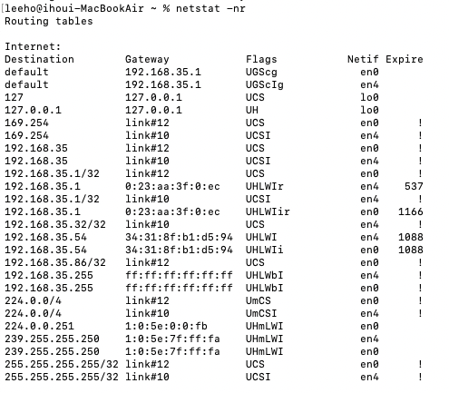

# 6장: 라우팅

### 개요

이번 장에서는 같은 네트워크를 넘어 다른 네트워트에게까지 데이터를 전송하는 기법인 라우팅에 대해서 알아봅니다.

---

### 이더넷은 같은 네트워크, 라우터는 다른 네트워크

- 우리가 이더넷을 통해 네트워킹을 한다면 기억해야할 것은 하나입니다. 우린 전송매체를 통해 반드시 물리적으로 데이터를 전달해야하며 이더넷을 사용하는 이상 같은 네트워크까지만 이동시킬 수 있다는 것입니다. 그렇다면 만약 다른 네트워크로 이동시켜야 한다면 어떻게 해야 할까요?
    - 다른 네트워크로 데이터를 전달하기 위해 필요한 것이 바로 라우터입니다. 라우터는 네트워크와 네트워크를 연결하기 때문이죠.
    - 즉 우리는 먼저 데이터의 목적지가 어느 네트워크에 속해있는지 파악합니다. 그리고 네트워크에 도달할 때까지 하나의 라우터와 라우터 사이로 데이터를 옮기는 작업을 반복합니다.
- 라우터는 IP 패킷을 전송합니다. 이것은 라우팅이 행하는 ‘라우팅'이라는 행위가 IP가 속하는 인터넷층에서 수행된다는 의미입니다.
    - 라우터는 목적지 네트워크를 도착하기 위한 길을 IP라는 매개체로 찾는 행위입니다.
    - 패킷을 전송할 때 라우터는 일반적으로는 라우터의 무한순환을 방지하기 위한 **Time To Live, TTL**과 오류 체크를 위한 **헤더 체크섬**만 변경시킵니다. 만약 NAT가 수행되는 경우라면 IP 주소도 수정됩니다.
    - 위에서 말했듯 라우터는 네트워크를 이어주는 것이었습니다. 하지만 이더넷이 움직일 수 있는 범위는 하나의 네트워크 안입니다. 따라서 라우터를 통해 다른 네트워크로 데이터가 넘어갈 땐 IP 패킷에 추가되는 **이더넷 헤더와 FCS는 새로운 것으로 교체**됩니다.

---

### 라우터의 생김새와 주소 설정

- 위 그림처럼 네트워크는 복수 개의 네트워크를 자신과 연결해 엮는 형태를 가집니다. 이 때 네트워크를 연결하기 위해선 라우터 인터페이스의 물리적인 배선에 IP를 설정해야 합니다. 또한 복수개의 인터페이스를 갖기 때문에 각각 IP 주소를 설정하면 됩니다.

---

### 데이터의 전송처를 결정하는 라우팅

- 라우터는 A 네트워크에서 전달된 데이터를 B 네트워크로 던지는 역할, 라우팅을 수행합니다. 그런데 B 네트워크가 과연 목적지와 어떤 관계인지 어떻게 알고 던지는 걸까요?
    - 라우터는 최초 자신과 연결된 네트워크에서 넘어온 IP 패킷을 수신합니다. 이 때의 목적지 MAC 주소는 자신입니다.
    - 목적지 IP 주소를 라우팅 테이블에서 검색합니다. 라우팅 테이블이란 자신과 연결된 네트워크 혹은 다른 라우터들에 대한 IP 주소입니다.
        - 만약 목적지 IP 주소가 자신과 연결된 네트워크에 해당된다면 해당 네트워크로 직접 접속하기로 결정합니다. 만약 다른 라우터라면 해당 라우터로 패킷을 보내도록 결정합니다.
        - 여기서 다음 전송할 곳은 **넥스트 홉**이라고 부릅니다.
- 라우팅 테이블에서 넥스트 홉이 정해지면 실제로 데이터를 전송하는 절차를 수행합니다. 데이터를 전송하기 위해선 MAC 주소를 알아야 합니다. 하지만 우리가 가진 정보는 IP 주소밖에 없습니다.
    - 혹시 기억하시나요? IP 주소를 통해 MAC 주소를 알아내는 법, 바로 **ARP 프로토콜**입니다.
    - 라우터는 MAC 주소를 얻기 위해 자동으로 ARP를 수행하고 알아낸 MAC 주소를 새로운 이더넷 헤더에 담습니다.
    - 이더넷 헤더는 TTL 값이 1 감소하고 헤더 체크섬이 재계산된 IP 패킷에 추가됩니다. 이후 새롭게 만들어진 이더넷 프레임을 넥스트홉에 전송합니다.
    - 다음 전달받은 라우터에서도 위와 동일한 작업을 수행합니다.
- 만약 새롭게 도착한 라우터에서 목적지 IP 주소에 해당되는 네트워크를 발견한다면 어떻게 될까요?
    - 목적지 주소가 192.168.0.1 이고 라우팅 테이블에 명시된 192.168.0.0/24 네트워크가 직접 접속할 수 있다면 위와 동일하게 ARP를 수행하고 프레임을 전송합니다.
    - 역시 MAC 주소가 필요합니다.
    - 라우터는 라우터 테이블에서 인식할 수 없는 IP 패킷은 모두 폐기합니다.

---

### 라우팅 테이블의 정보

- 라우팅을 하기 위해선 라우터 테이블이 필수적입니다. 어떤 네트워크로 IP 패킷을 보내야할지 알아야 하니까요. 라우터에 등록된 네트워크 정보를 우린 **루트 경로** 혹은 **경로 정보**라고 부릅니다.
    - 경로 정보에서 가장 중요한 것은 **네트워크 주소/서브넷 마스크와 넥스트 홉 주소**입니다.
    - MAC OS에서는 `netstat -nr` 명령어를 통해 확인할 수 있습니다.
        
        

        
- 라우터 테이블에 경로 정보를 등록하기 위해서 총 3가지 방법이 존재합니다.
    - 직접 접속
        - 라우팅 인터페이스에 IP 주소를 직접 설정하고 활성화하면 됩니다. 이 방법은 직접 접속된 네트워크밖에 모르고 원격 네트워크의 경로 정보는 알 수 없습니다.
    - 스태틱 라우팅
        - 라우터에 직접 접속되지 않은 원격 네트워크의 경로 정보를 등록하는 방법입니다. 라우터에 직접 커맨드를 입력해 수동으로 등록합니다.
    - 라우팅 프로토콜
        - 라우팅 프로토콜을 활성화하면 라우터끼리 서로 정보를 교환해 라우팅 테이블에 필요한 경로 정보를 등록해줍니다.
        - 규모에 따라 프로토콜이 조금씩 다릅니다. 소규모 네트워크의 경우 **Routing Information Protocol, RIP**를 사용합니다. 중~대규모 네트워크는 **Open Shortest Path First, OSPF**를 사용합니다. 마지막으로 ISP가 제공하는 Autonomous System처럼 거대한 네트워크, 주로 인터넷 백본에서는 **Border Gateway Protocol, BGP**를 사용합니다.
    - 라우터는 만약 조금이라도 전송 가능성이 있는 경로 정보라면 필요로 합니다. 하지만 모든 네트워크의 경로 정보를 등록하긴 매우 어렵습니다. 따라서 이런 경우 넥스트 홉이 공통인 원격 네트워크를 하나로 모아 등록하는 **경로 요약**이 고안됐습니다.
        - 일치하는 네트워크 주소를 CIDR 표기법을 통해 표시합니다. 예를 들어 10.2.0.0/24, 10.2.1.0/24, 10.2.2.0/24, 10.2.3.0/24 주소의 넥스트 홉이 10.0.0.2라면 **10.2.0.0/16**으로 경로를 요약합니다.
        - 이런 경로 요약을 극적인 지점까지 적용한 것이 디폴트 경로 **0.0.0.0/0** 입니다.

---

### L3 스위치

- L3 스위치는 L2 스위치에 라우터 기능을 추가한 기기입니다. 이 말은 L2 스위치와 라우터가 데이터를 전송하는 두 개의 방식 모두 가능하다는 의미입니다. 즉 같은 네트워크로 전송할 때는 L2 스위치처럼 MAC 주소를 기반으로, 다른 네트워크로 전송할 때는 IP 주소를 기반으로 전송합니다.
    - 이를 위해 L3 스위치는 **Virtual LAN, VLAN 기능**을 이용합니다.

---

### VLAN

- L2 스위치는 보통 하나의 네트워크를 구성합니다. 하지만 하나의 네트워크에 여러 기기를 연결하는 경우 **불필요한 데이터 전송이 많이 발생**합니다. 이런 문제점을 해결하기 위해 네트워크를 분리할 필요가 있습니다. 이렇게 하나의 네트워크를 여러 개로 분할하는 것이 VLAN입니다.
    - 동작 원리는 간단합니다. L2 스위치는 각 포트별로 이더넷 프레임을 전송합니다. 이를 VLAN으로 나눠 같은 VLAN으로 묶인 포트끼리만 프레임을 전송하게 하는 것이 전부입니다.
        - VLAN의 포트는 자유롭게 설정할 수 있습니다.
        - 나눠진 VLAN은 각기 다른 L2 스위치로 취급되고 이들은 연결되어 있지 않습니다.
    - 이를 통해 데이터 전송 범위를 제한할 수 있기 때문에 **보안 향상**도 기대할 수 있습니다.
    - 만약 서로 분리된 네트워크끼리 통신이 필요하다면 이 때 다른 네트워크 통신에 필요한 **라우터와 L3 스위치**를 사용합니다.
        - 라우팅을 위해선 IP 주소가 필요합니다. IP주소는 L3 스위치 내부의 가상 인터페이스(VLAN 인터페이스)에 설정하거나 포트 자체에 설정할 수 있습니다.
- VLAN은 여러 개의 스위치에 걸쳐서 만들 수 있습니다. 이 땐 스위치간의 연결이 VLAN마다 필요합니다. 예를 들어 L2 스위치 A,B에 VLAN 1,2가 나눠져 존재할 때 A,B는 1,2의 VLAN을 위해 두 줄의 연결이 필요합니다. 이 때 이를 효율적으로 하나로 묶어주는 것이 바로 **태그 VLAN**입니다.
    - 태그 VLAN 포트로 송수신하는 이더넷 프레임에는 VLAN 태극 별도로 추가됩니다. 이를 통해 전송되는 이더넷 프레임이 어느 VLAN의 이더넷 프레임인지 알 수 있습니다.
        - VLAN 태그는 TPID, TCI로 구성됩니다.